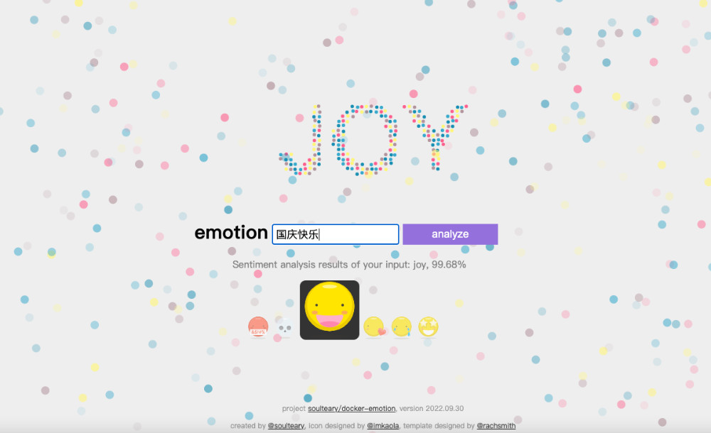

# Text Emotion / Sentiment Analysis Tools

[中文教程](https://soulteary.com/2022/09/30/nlp-text-sentiment-analysis-application-using-docker-and-huggingface.html)

Let's take a look at the final effect first. In a simple interface, as long as we enter the content, we can get the sentiment analysis corresponding to the content:



Of course, because the model I chose is a pre-trained model, and considering the resource consumption, I did not use a large model with a larger number of parameters, so the accuracy and classification may not be 100% accurate, but after testing, in most cases, this application is It can meet the needs of my follow-up articles.

If you have higher requirements, you can refer to this article for model replacement, :D

If you're in a hurry to try out the app, you can quickly start it with the following Docker command:

```bash
docker run --rm -it -p 3000:3000 soulteary/emotion:2022.09.30
```

Open the browser, enter http://localhost:3000 , you can see the webui.