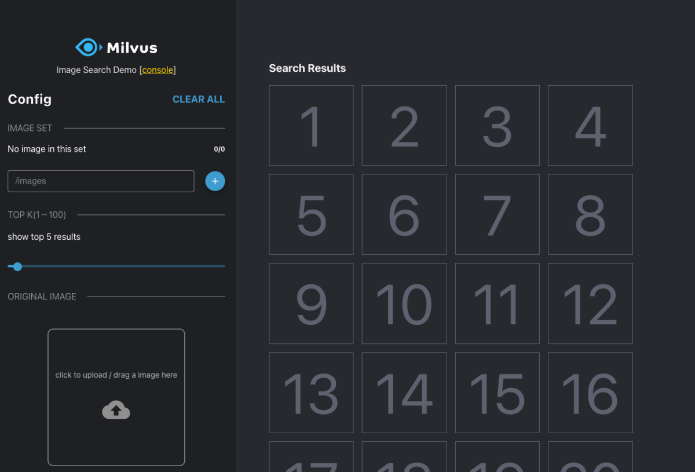
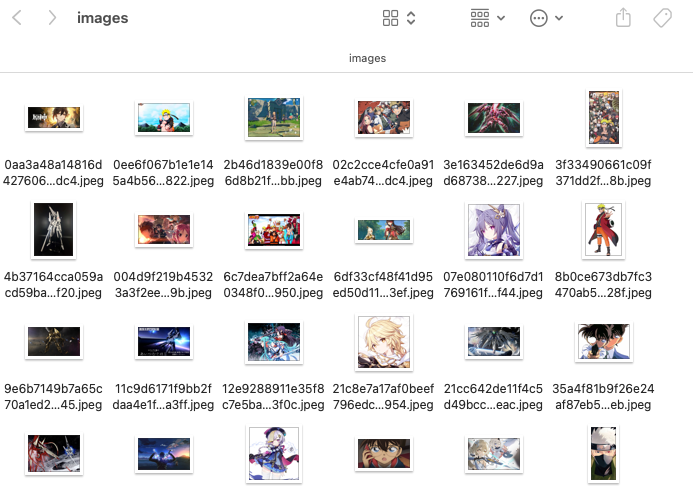
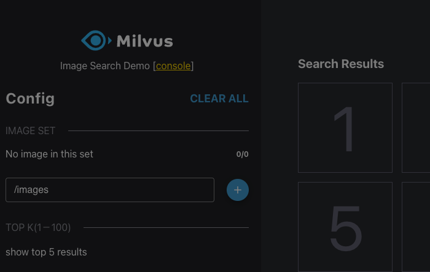
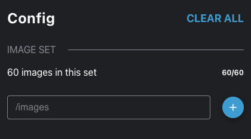

# Reverse Image Search

[中文教程](https://soulteary.com/2022/09/24/use-docker-and-milvus-to-quickly-build-a-local-lightweight-image-search-engine.html)

In this article, I will share how to use Docker to build a lightweight image search engine that can run locally, to achieve a function that we are accustomed to in daily life, but it is quite troublesome to implement: search for images by image.


---

If you have Docker installed, you can execute this command locally to quickly start a local image search engine to quickly search for images by image:

```bash
docker run --rm -it --name=milvus -p 3000:3000 -v `pwd`/images:/images soulteary/image-search-app:2.1.0
```

After the command is executed, we can see the following interface by visiting http://127.0.0.1:3000 in the browser. I personally think it looks better than the Demo interface on the official website of the Milvus project :D



Before using this local image search engine, we need to prepare some images.

I used Baidu image search and found about 60 wallpapers with the keywords of games and anime. After throwing these images into the above command and executing the command, they were automatically created locally `images` directory.



Then click the “+” button in the interface, the page will automatically turn gray, indicating that the application is using the model to encode the image (embedding), and the calculated (extracted) feature vector is stored in the vector database Milvus.

The graying time here is related to the performance of our local machine and the number of pictures just placed in the folder. The stronger the device performance, the less picture data, which can reduce the waiting time.



When the image data is processed, the interface will return to normal, and the interface will prompt us to load the normal number of images.



Next, we can first use a cartoon image that is not included in the 60 to verify that the search results are as expected:


